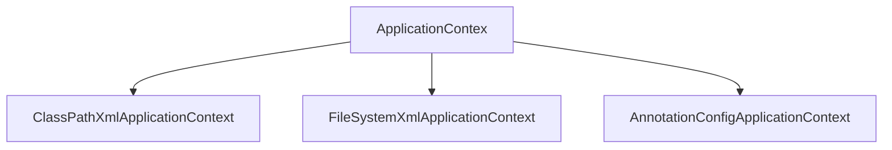

# Spring入门

## 一、Spring概述
Spring是分层的Java SE/EE应用 full-stack轻量级开源框架，以IoC（Inverse Of Control：反转控制）和AOP（Aspect Oriented Programming：面向切面编程）为内核，提供了展现层Spring MVC和持久层Spring JDBC以及业务层事务管理等众多的企业级应用技术，还能整合开源世界众多著名的第三方框架和类库，逐渐成为使用最多的Java EE企业应用开源框架。

### 1.1、IOC概述
**IOC(反转控制)：**
获取资源的方式分为主动式和被动式
主动式：获取资源要自己创建，比如new一个对象并设置属性，但是在需要new的对象比较复杂或者需要的对象过多时，就无法实现。
被动式：资源的获取不是自己创建，而是交给一个容器来创建并设置。这个过程就叫做反转控制，由原来的我们自己创建控制对象，改为交给容器来处理这些事。从主动创建变为被动获取。好处：降低程序间的依赖关系，减少计算机程序耦合。

## 二、Spring的使用（基于xml配置）
### 2.1、pom中导入依赖jar包
```xml
<dependencies>
    <dependency>
        <groupId>org.springframework</groupId>
        <artifactId>spring-context</artifactId>
        <version>5.0.2.RELEASE</version>
    </dependency>
</dependencies>
```
### 2.2、创建xml配置文件
```xml
<?xml version="1.0" encoding="UTF-8"?>
<beans xmlns="http://www.springframework.org/schema/beans" xmlns:xsi="http://www.w3.org/2001/XMLSchema-instance"
       xmlns:context="http://www.springframework.org/schema/context"
       xsi:schemaLocation=" http://www.springframework.org/schema/beans
       http://www.springframework.org/schema/beans/spring-beans.xsd
       http://www.springframework.org/schema/context
       http://www.springframework.org/schema/context/spring-context.xsd">
</beans>
```
### 2.3、把对象的创建交给spring管理
#### 创建bean对象的三种方式
1. 第一种方式：使用默认构造函数创建在spring的配置文件种使用bean标签，只使用id和class属性，没有其他属性时，采用的就是默认构造函数创建bean对象，要求此类中必须有默认构造函数。
在配置文件中加上。
```xml
<bean id="accountService" class="cn.luming.service.impl.AccountServiceImpl"></bean>
```
id：获取时的唯一标志
class：反射创建的全限定类名

2. 第二种方式：使用工厂中的方法创建对象，或者使用某个类中的方法创建对象，并存入spring。和第三种方式相同，在创建jar包里的对象常用。
```xml
<bean id="instanceFactory" class="cn.luming.factory.InstanceFactory"></bean>
<bean id="accountService" factory-bean="instanceFactory" factory-method="getIAccountService"></bean>
```
3. 第三种方式：使用静态工厂中的静态方法创建对象，或者使用某个类中的静态方法，并存入spring中
```xml
<bean id="accountService" class="cn.luming.factory.StaticFactory" factory-method="getIAccountService"></bean>
```

#### bean的作用范围
使用scope属性
作用：指定bean的作用范围
取值：
1. singleton：单例（默认值）
2. prototype：多例
3. request：作用于web应用的请求范围
4. session：作用于web应用的会话范围
5. golobal-session：作用于集群环境的会话范围，不是集群环境是就是session

#### bean对象的生命周期
* 单例对象
    容器创建时出生，随着容器的销毁而消亡。单例对象的生命周期和容器相同。
* 多例对象
    使用对象时spring创建，在使用过程中一直存在。长时间不用且没有别的对象引用时，被垃圾回收器回收。

### 2.4、获取spring的IOC核心容器，并根据id获取对象
1. 获取核心对象
```Java
ApplicationContext ac = new ClassPathXmlApplicationContext("bean.xml");
```
* ApplicationContext的三个实现类

ClassPathXmlApplicationContext：加载类路径下的配置文件
FileSystemXmlApplicationContext：加载磁盘任意路径下的配置文件（有访问权限）
AnnotationConfigApplicationContext：用于读取注解创建容器

* 核心容器两个接口的区别
ApplicationContext：单例适用
创建对象使用的是立即加载的方式，只要一读取配置文件就创建对象
BeanFactory：多例适用
延迟加载，根据获取id对象时再创建对象。

2. 根据id获取bean对象
强转方式
```Java
IAccountService as = (IAccountService) ac.getBean("accountService");
```
传入接收类型的字节码方式
```Java
IAccountService as = ac.getBean("accountService",IAccountService.class);
```

## 三、spring的依赖注入（Dependenct Injection）
### 3.1、依赖注入概述
在当前类需要用到其他类的对象，由spring提供，我们只需要在配置文件中说明依赖关系的维护，就称为依赖注入。
三种可以注入的数据：
* 基本类型和String
* 其他bean类型（在配置文件中或者注解中配置的bean）
* 复杂类型和集合类型

三种注入方式
* 由构造函数提供
使用标签constructor-arg
标签的属性：
type：指定注入的数据的数据类型，该数据类型也是g构造函数中某个或某些参数的数据类型
index：指定注入数据给构造函数中指定索引位置赋值。索引位置从0开始
name：指定给构造函数中指定名称参数赋值(常用)
value：用于提供基本类型和string类型的数据
ref：用于指定其他的bean类型数据，指在spring的IOC中出现过的bean对象
优势：在获取bean对象时，注入数据是必须的操作，否则无法创建成功
弊端：改变了bean的实例化方式，在创建对象时如果不使用这些数据时，也必须提供。
```xml
 <bean id="accountService" class="cn.luming.service.impl.AccountServiceImpl">
        <constructor-arg name="name" value="test"></constructor-arg>
        <constructor-arg name="age" value="12"></constructor-arg>
        <constructor-arg name="birthday" ref="now"></constructor-arg>
    </bean>
    <!-- 配置日期对象 -->
    <bean id="now" class="java.util.Date"></bean>
```
* 使用set方法提供（常用）
使用标签：property
标签的属性：
name：指定注入时所调用的set方法名称
value：用于提供基本类型和string类型的数据
ref：用于指定其他的bean类型数据，指在spring的IOC中出现过的bean对象
优势：创建对象时没有明确的限制，可以直接使用默认构造函数
弊端：如果某个成员必须有值，获取对象时set方法可能不会执行
```xml
<bean id="accountService2" class="cn.luming.service.impl.AccountServiceImpl2">
        <property name="name" value="test02"></property>
        <property name="age" value="11"></property>
        <property name="birthday" ref="now"></property>
    </bean>
```
* 复杂类型的注入（集合类型的注入）
用于给List结构注入的标签：list array set
用于给Map结构注入的标签：map props
结构相同，标签可以互换
```xml
<bean id="accountService3" class="cn.luming.service.impl.AccountServiceImpl3">
        <property name="myStrs">
            <array>
                <value>AAA</value>
                <value>BBB</value>
                <value>CCC</value>
            </array>
        </property>
        <property name="myMap">
            <map>
                <entry key="test01" value="aaa"></entry>
                <entry key="test02" value="bbb"></entry>
            </map>
        </property>    
    </bean>
```
* 使用注解提供

## 四、Spring的使用（基于注解配置）
### 4.1、创建bean对象
1. @Component：把当前类存入 spring容器中，value属性可以指定名称，默认为本类名称首字母小写。
2. @Controller：一般用于表现层
3. @Service：一般用于业务层
4. @Repository：一般用在持久层

注意：以上三种注解方式和Component相同，其目的是使三层对象更加清晰。
```xml
<?xml version="1.0" encoding="UTF-8"?>
<beans xmlns="http://www.springframework.org/schema/beans" xmlns:xsi="http://www.w3.org/2001/XMLSchema-instance"
       xmlns:context="http://www.springframework.org/schema/context"
       xsi:schemaLocation=" http://www.springframework.org/schema/beans
       http://www.springframework.org/schema/beans/spring-beans.xsd
       http://www.springframework.org/schema/context
       http://www.springframework.org/schema/context/spring-context.xsd">
    <!-- 指定要扫描的包 -->
    <context:component-scan base-package="cn.luming"/>
</beans>
```

```java
@Component(value = "accountService")
public class AccountServiceImpl implements IAccountService {
    IAccountDao dao = new AccountDaoImpl();
    public AccountServiceImpl(){
        System.out.println("对象创建");
    }
    public void saveAccount() {
        dao.saveAccount();
    }
}
```

### 4.2、依赖注入
#### 用于注入数据的
1. @Autowired：
    作用：自动按照类型注入。只要容器中有唯一的一个bean对象类型和要注入的变量类型匹配，就可以注入成功。如果ioc容器中有多个类型匹配时，会根据注入的类型变量名称去匹配是否有和该名称相同的bean对象，有就成功，无就失败。
    出现位置：变量或方法上
    注意：在使用注解注入，set方法就不是必须的了    
```java
@Autowired
private IAccountDao dao = null;
```

2. @Qualifier:
    作用：在按照类中注入的基础上再按照名称注入，给类成员注入时不能单独使用必须和Autowired一起使用，在方法参数注入时可以单独使用。
    属性：value：用于指定注入bean的id
```java
@Autowired
@Qualifier(value = "accountDao2")
private IAccountDao dao = null;
```

3. @Resource：
    作用：直接按照bean的id注入，可以单独使用
    属性：name：用于指定bean的id 
```java
@Resource(name = "accountDao2")
private IAccountDao dao = null;
```

以上三种注入都只能注入其他bean类型的数据，而基本类型和String无法使用，并且，**集合类型的注入只能通过xml实现** 。

4. @Value：
    作用：用于注入基本类型和String类型
    属性：value：用于指定数据的值，可以使用spring中的EL表达式${表达式}

#### 用于改变作用范围的
* @Scope：
    作用：用于指定bean的范围
    属性：value：指定范围的取值。常用：singleton（默认）：单例、prototype：多例
    
#### 和生命周期相关
1. @PreDestroy
    作用：用于指定销毁方法
2. @PostConstruct
    作用：用于初始化方法

### 4.3、纯注解配置方法
* 创建一个配置类，和bean.xml作用相同
* 使用spring新注解：
    1. @Configuration:指定当前类是一个配置类
        注意：当该类为AnnotationConfigApplicationContext的参数时可以省略该注解
    2. @ComponentScan:指定spring在创建容器时要扫描的包
        属性：value/basePackages：用于指定创建容器时扫描的包等同于xml中的`<context:component-scan base-package="cn.luming"></context:component-scan>`
    3. @Bean:用于当前方法的返回值作为bean对象存入spring的IOC容器中
        属性：name:用于指定bean的id，默认值是当前方法名称
        注意：使用直接配置方法时，如果方法有参数，spring会去容器中查找使用有可用参数。查找方式和Autowired相同
    4. @Import:用于导入其他配置类        
        属性：value：用于指定其他类的字节码。使用import后，有import的类就主配置类，导入的都是子配置类。
    5. @PropertySource:用于指定properties文件的位置
        属性：value：指定文件的名称和路径
        关键字：classpath表示类路径下
        

主配置类        
```Java
@Configuration
@ComponentScan(basePackages = {"cn.luming"})
@Import({JdbcConfig.class})
@PropertySource("classpath:jdbc.properties")
public class SpringConfiguration {
}
```
子配置类
```java
public class JdbcConfig {
    @Value("${driverClass}")
    private String driver;
    @Value("${jdbcUrl}")
    private String url;
    @Value("${user}")
    private String userName;
    @Value("${password}")
    private String password;
    /**
     * 创建一个QueryRunner对象
     *
     * @param source
     * @return
     */
    @Bean(name = "runner")
    @Scope("prototype")
    public QueryRunner createQueryRunner(DataSource source) {
        return new QueryRunner(source);
    }
    /**
     * 创建数据源对象
     * @return
     */
    @Bean(name = "dataSource")
    public DataSource createDataSource(){
        try {
            ComboPooledDataSource ds = new ComboPooledDataSource();
            ds.setDriverClass(driver);
            ds.setJdbcUrl(url);
            ds.setUser(userName);
            ds.setPassword(password);
            return ds;
        } catch (Exception e) {
            throw new RuntimeException(e);
        }
    }
}
```
* 测试方法中创建对象时使用
```Java
ApplicationContext ac = new AnnotationConfigApplicationContext(SpringConfiguration.class);
```

## 五、spring整合junit的配置
1. 导入spring整合junit的jar包（坐标）
```xml
<dependency>
    <groupId>org.springframework</groupId>
            <artifactId>spring-test</artifactId>
    <version>5.0.2.RELEASE</version>
</dependency>
```
2. 使用junit提供的一个注解把原有的main方法替换为spring提供的@Runwith运行器
3. 告知spring的运行器，spring的IOC创建是基于注解或xml的，并说明位置
    @ContextConfiguration
        Locations：指定xml文件的位置，加上classpath表示类路径下
        classes：指定注解类所在位置
    注意：使用spring5.x版本时，要求junit必须在4.12以上      
```Java
@RunWith(SpringJUnit4ClassRunner.class)
@ContextConfiguration(classes = SpringConfiguration.class)
public class AccountServiceTest {
    @Autowired
    private IAccountService as = null;
    @Test
    public void testFindAll() {
         //执行方法
        List<Account> accounts = as.finAll();
        for (Account account : accounts) {
            System.out.println(account);
        }
    }
}
```

## 六、AOP
### 6.1、 AOP的概念
#### 6.1.1 什么是AOP
AOP：全称是Aspect Oriented Programming即：面向切面编程。
简单的说它就是把我们程序重复的代码抽取出来，在需要执行的时候，**使用动态代理的技术**，在不修改源码的
基础上，对我们的已有方法进行增强。

#### 6.1.2 AOP作用及优势
作用： 
  在程序运行期间，不修改源码对已有方法进行增强。 
优势： 
  减少重复代码     
  提高开发效率     
  维护方便

### 6.2、spring的AOP
#### 6.2.1 说明
spring的aop，通过配置的方式来实现。
#### 6.2.2 AOP相关术语
* Joinpoint(连接点): 
   所谓连接点是指那些被拦截到的点。在spring中,这些点指的是方法,因为spring只支持方法类型的连接点。
* Pointcut(切入点): 
   所谓切入点是指我们要对哪些Joinpoint进行拦截的定义。    
* Advice(通知/增强): 
   所谓通知是指拦截到Joinpoint之后所要做的事情就是通知。 
   通知的类型：前置通知,后置通知,异常通知,最终通知,环绕通知。
* Introduction(引介): 
   引介是一种特殊的通知在不修改类代码的前提下, Introduction可以在运行期为类动态地添加一些方法或Field。
* Target(目标对象): 
   代理的目标对象。  
* Weaving(织入): 
   是指把增强应用到目标对象来创建新的代理对象的过程。 
   spring采用动态代理织入，而AspectJ采用编译期织入和类装载期织入。 
Proxy（代理）: 
   一个类被AOP织入增强后，就产生一个结果代理类。 
* Aspect(切面): 
   是切入点和通知（引介）的结合。

### 6.3、spring中基于XML的AOP配置步骤
1. 配置spring的ioc，把service对象配置进来
2. 使用aop:config标签表明开始AOP的配置
3. 使用aop:aspect标签表明配置切面
    1.  id属性：是给切面提供一个唯一标识
    2.  ref属性：是指定通知类bean的Id。
4. 在aop:aspect标签的内部使用对应标签来配置通知的类型
    * aop:before：表示配置前置通知在切入点方法之前执行
        method属性：用于指定Logger类中哪个方法是前置通知
        pointcut属性：用于指定切入点表达式，该表达式的含义指的是对业务层中哪些方法增强
    * aop:after-returning：
        后置通知：在切入点方法正常执行之后之后
    * aop:after-throwing：
        异常通知：在切入点产生异常时执行
    * aop:after：
        最终通知：无论切入点是否正常执行，都会执行
    * aop:around
        环绕通知：是spring框架为我们提供的一种可以在代码中手动控制增强方法何时执行的方式
        使用方式如下
        
```Java
public Object aroundPrintLog(ProceedingJoinPoint pjp) {
        Object rtValue = null;
        try {
            //得到方法执行所需参数
            Object[] args = pjp.getArgs();
            System.out.println("aroundPrintLog 前置");
            //明确调用业务层方法（切入点方法）
            rtValue = pjp.proceed(args);
            System.out.println("aroundPrintLog 后置");
            return rtValue;
        } catch (Throwable throwable) {
            System.out.println("aroundPrintLog 异常");
            throw new RuntimeException(throwable);
        } finally {
            System.out.println("aroundPrintLog 最终");
        }
    }
```
    * aop:pointcut：
        配置通用切入点表达式
        id：指定表达式唯一标志
        expression：指定表达式内容
        注意：此标签写在aop:aspect内部只能当前切面使用。如果写在aop:aspect外部，所有切面都可以使用
    * 切入点表达式的写法：
        关键字：execution(表达式)
        标准的表达式写法：`public void cn.luming.service.impl.AccountServiceImpl.saveAccount()`
        通常写法：`cn.luming.service.impl.*.*(..)`

```xml
<?xml version="1.0" encoding="UTF-8"?>
<beans xmlns="http://www.springframework.org/schema/beans"
       xmlns:xsi="http://www.w3.org/2001/XMLSchema-instance"
       xmlns:aop="http://www.springframework.org/schema/aop"
       xsi:schemaLocation="http://www.springframework.org/schema/beans
        http://www.springframework.org/schema/beans/spring-beans.xsd
        http://www.springframework.org/schema/aop
        http://www.springframework.org/schema/aop/spring-aop.xsd">
    <bean id="accountService" class="cn.luming.service.impl.AccountService"></bean>
    <bean id="loggers" class="cn.luming.utils.Logger"></bean>
    <aop:config>
        <aop:aspect id="logAdvice" ref="loggers">
            <aop:before method="beforePrintLog" pointcut-ref="pt1"></aop:before>
            <aop:after-returning method="afterReturningPrintLog" pointcut-ref="pt1"></aop:after-returning>
            <aop:after-throwing method="afterThrowingPrintLog" pointcut-ref="pt1"></aop:after-throwing>
            <aop:after method="afterPrintLog" pointcut-ref="pt1"></aop:after>
            <aop:pointcut id="pt1" expression="execution(* cn.luming.service.impl.*.*(..))"/>
            <aop:around method="aroundPrintLog" pointcut-ref="pt1"></aop:around>
        </aop:aspect>
    </aop:config>
</beans>
```
5. 注意：在pom中导入对应的解析切入点的依赖
```xml
<dependency>
            <groupId>org.aspectj</groupId>
            <artifactId>aspectjweaver</artifactId>
            <version>1.8.7</version>
        </dependency>
```

## 七、spring的事务控制
### 7.1、spring基于xml的声明式事务控制
* 配置事务管理器
* 配置事务通知，需要导入tx和AOP的约束
    1. id：事务通知的唯一标志
    2. transaction-manager：给事务通知提供一个事务管理器
* 配置事务的属性
    1. isolation：用于指定事务的隔离级别，默认是DEFAULT，表示数据库的默认隔离级别
    2. no-rollback-for：用于指定一个异常，当产生该异常时事务不回滚，产生其他异常时事务回滚，没有默认值表示任何异常都回滚
    3. propagation：用于指定事务的传播行为，默认值是REQUIRED，表示一定会有事务，增删改操作可以选择。查询方法选择SUPPORTS
    4. read-only：用于指定事务是否设定只读，只有查询方法可以设置
    5. rollback-for：用于指定一个异常，当产生该异常事务回滚，产生其他异常事务不回滚，没有默认值表示如何异常都回滚
    6. timeout：用于指定事务的超时事件，默认值是-1，表示永不超时。以秒为单位
* 配置AOP
    1. 配置切入点表达式
    2. 建立切入点表达式和事务通知的对应关系

```xml
<?xml version="1.0" encoding="UTF-8"?>
<beans xmlns="http://www.springframework.org/schema/beans"
       xmlns:xsi="http://www.w3.org/2001/XMLSchema-instance"
       xmlns:aop="http://www.springframework.org/schema/aop"
       xmlns:tx="http://www.springframework.org/schema/tx"
       xsi:schemaLocation="
        http://www.springframework.org/schema/beans
        http://www.springframework.org/schema/beans/spring-beans.xsd
        http://www.springframework.org/schema/tx
        http://www.springframework.org/schema/tx/spring-tx.xsd
        http://www.springframework.org/schema/aop
        http://www.springframework.org/schema/aop/spring-aop.xsd">
    <!--数据库配置-->
    <bean id="dataSource" class="org.springframework.jdbc.datasource.DriverManagerDataSource">
        <property name="driverClassName" value="${driverClassName}"></property>
        <property name="url" value="${url}"></property>
        <property name="username" value="${username}"></property>
        <property name="password" value="${password}"></property>
    </bean>

    <!-- 引入配置文件 -->
    <bean id="propertyConfigurer" class="org.springframework.beans.factory.config.PropertyPlaceholderConfigurer">
        <property name="location" value="jdbc.properties"></property>
    </bean>
    <!--配置账户持久层-->
    <bean id="accountDao" class="cn.luming.Dao.impl.AccountDaoImpl">
        <property name="dataSource" ref="dataSource"></property>
    </bean>
    <!--配置账户业务层-->
    <bean id="accountService" class="cn.luming.service.impl.AccountServiceImpl">
        <property name="accountDao" ref="accountDao"></property>
    </bean>

<!-- =============================================== -->
<!--    spring基于xml声明式事务配置-->
    <!--配置事务管理器-->
    <bean id="transactionManager" class="org.springframework.jdbc.datasource.DataSourceTransactionManager">
        <property name="dataSource" ref="dataSource"></property>
    </bean>
    <!-- 配置事务通知，需要导入tx和AOP的约束 -->
    <tx:advice id="txAdvice" transaction-manager="transactionManager">
        <!-- 配置事务的属性 -->
        <tx:attributes>
            <tx:method name="*" propagation="REQUIRED" read-only="false" />
            <tx:method name="find*" propagation="SUPPORTS" read-only="true" />
        </tx:attributes>
    </tx:advice>
    <!-- 配置AOP -->
    <aop:config>
        <!-- 配置切入点表达式 -->
        <aop:pointcut id="pt1" expression="execution(* cn.luming.service.impl.*.*(..))"/>
        <!-- 建立切入点表达式和事务通知的对应关系 -->
        <aop:advisor advice-ref="txAdvice" pointcut-ref="pt1"></aop:advisor>
    </aop:config>
</beans>
```
### 7.2、spring基于注解的声明式事务控制
1. 配置事务管理器
2. 开启spring对注解事务的支持
3. 在需要事务支持的地方使用@Transactionl注解，并配置事务的属性

bean.xml
```xml
<?xml version="1.0" encoding="UTF-8"?>
<beans xmlns="http://www.springframework.org/schema/beans"
       xmlns:xsi="http://www.w3.org/2001/XMLSchema-instance"
       xmlns:aop="http://www.springframework.org/schema/aop"
       xmlns:tx="http://www.springframework.org/schema/tx"
       xmlns:context="http://www.springframework.org/schema/context"
       xsi:schemaLocation="
        http://www.springframework.org/schema/beans
        http://www.springframework.org/schema/beans/spring-beans.xsd
        http://www.springframework.org/schema/tx
        http://www.springframework.org/schema/tx/spring-tx.xsd
        http://www.springframework.org/schema/aop
        http://www.springframework.org/schema/aop/spring-aop.xsd
        http://www.springframework.org/schema/context
        http://www.springframework.org/schema/context/spring-context.xsd">
    <!-- 引入配置文件 -->
    <bean id="propertyConfigurer" class="org.springframework.beans.factory.config.PropertyPlaceholderConfigurer">
        <property name="location" value="jdbc.properties"></property>
    </bean>
    <!-- 配置数据库 -->
    <bean id="dataSource" class="org.springframework.jdbc.datasource.DriverManagerDataSource">
        <property name="driverClassName" value="${driverClassName}"></property>
        <property name="url" value="${url}"></property>
        <property name="username" value="${username}"></property>
        <property name="password" value="${password}"></property>
    </bean>
    <!-- 配置spring创建容器时需要扫描的包 -->
    <context:component-scan base-package="cn.luming"></context:component-scan>
    <!-- 配置jdbcTemplate -->
    <bean id="配置jdbcTemplate" class="org.springframework.jdbc.core.JdbcTemplate">
        <property name="dataSource" ref="dataSource"></property>
    </bean>
    <!-- 配置事务管理器 -->
    <bean id="transactionManager" class="org.springframework.jdbc.datasource.DataSourceTransactionManager">
        <property name="dataSource" ref="dataSource"/>
    </bean>
    <!-- 开启spring对注解事务的支持 -->
    <tx:annotation-driven transaction-manager="transactionManager"></tx:annotation-driven>

</beans>
```
service
```Java
@Service("accountService")
@Transactional(propagation = Propagation.SUPPORTS, readOnly = true)
public class AccountServiceImpl implements IAccountService {
    @Autowired
    private IAccountDao accountDao;
    public Account findAccountById(Integer id) {
        return accountDao.findAccountById(id);
    }
    @Transactional(propagation = Propagation.REQUIRED, readOnly = false)
    public void transfer(String sourceName, String targetName, Float money) {
        //根据名字查询账户
        Account source = accountDao.findAccountByName(sourceName);
        Account target = accountDao.findAccountByName(targetName);
        //转出账户减钱
        source.setMoney(source.getMoney() - money);
        target.setMoney(target.getMoney() + money);
        //更新
        accountDao.updateAccount(source);
        //int i = 1 / 0;
        accountDao.updateAccount(target);
    }
}
```
